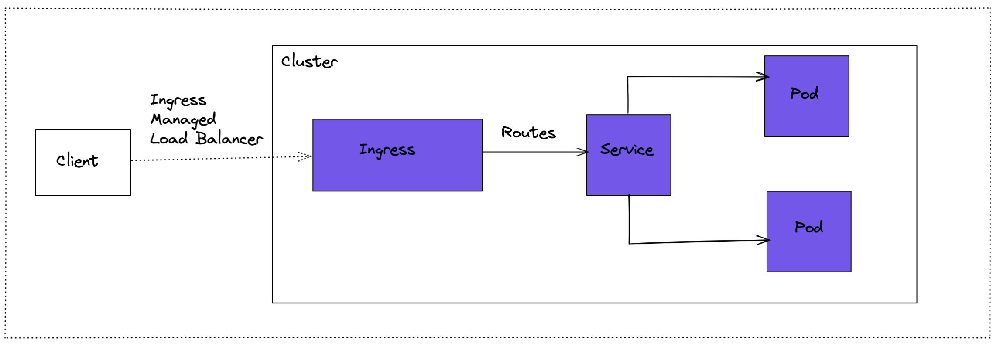
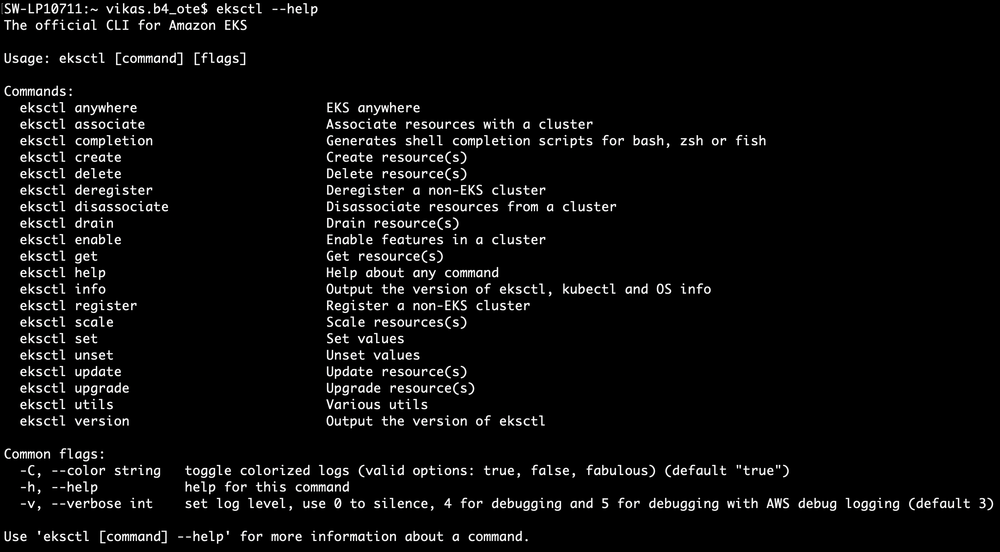
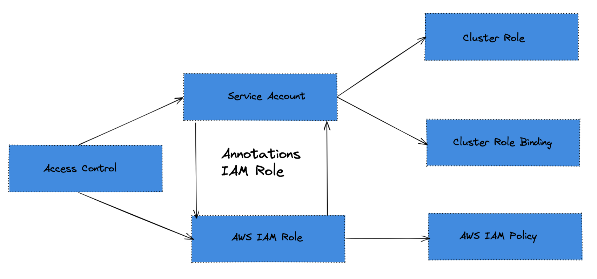

## Building Ingress Controller in EKS

Well, As we all know that kubernetes is cluster is not a childs play & when its come to the networking part Oh Boy! you have to be careful here because one wrong move & BOOM! you are in the bottom of the ocean with a ship's anchor tied to you feet :P
So you have to play smartly here. 

So, Kubernetes Networking is critical to manage the K8s cluster for those services who needs to communicate to the outside etities.

Also, we don't want to expose every service publically so here the Ingress Controller comes into the picture. Ingress Controller is used to route the traffic to the particular service which is created for publicly accesses hosted inside the cluster.

<br>
<br>




<br>
<br>

K8s Ingress controls the flow of the user's request, As the above diagram suggests ingress receives the traffic and after matching the user's request it will then forward it to the target service.

<br>
<br>


## Requirements:
- IAM User with Administrator Privileges [ don't use root user ]
- eksctl utility installed

<br>
<br>

## <ins> Create EKS Cluster using eksctl </ins>

<br>

**STEP-01 :** First we will see what are the arguments supported by eksctl,

<br>



<br>


Here, we will be moving forward with the argument "create" which is used to create the cluster.

<br>

***It will take 15 to 20 minutes to create the Cluster Control Plane***

```
eksctl create cluster --name=Test-EKS \
                      --region=us-east-2 \
                      --zones=us-east-2a,us-east-2b \
                      --without-nodegroup 
```

<br>

Get List of clusters,
```
eksctl get cluster  
```

<br>

**Step-02:** Create & Associate IAM OIDC Provider for our EKS Cluster

IODC - OpenID Connect


```
eksctl utils associate-iam-oidc-provider \
    --region us-east-1 \
    --cluster eksdemo1 \
    --approve
```
<br>

After you create an IAM OIDC identity provider, you must create one or more IAM roles. A role is an identity in AWS that doesn't have its own credentials (as a user does). But in this context, a role is dynamically assigned to a federated user that is authenticated by your organization's IdP. The role permits your organization's IdP to request temporary security credentials for access to AWS. The policies assigned to the role determine what the federated users are allowed to do in AWS.

<br>

**Step-04:** Create Node Group with additional Add-Ons in Public Subnets

```
# Create Public Node Group   
eksctl create nodegroup --cluster=eksdemo1 \
                       --region=us-east-1 \
                       --name=eksdemo1-ng-public1 \
                       --node-type=t3.medium \
                       --nodes=2 \
                       --nodes-min=2 \
                       --nodes-max=4 \
                       --node-volume-size=20 \
                       --ssh-access \
                       --ssh-public-key=kube-demo \
                       --managed \
                       --asg-access \
                       --external-dns-access \
                       --full-ecr-access \
                       --appmesh-access \
                       --alb-ingress-access 
```

<br>

**Step-04:** Verify Cluster & Nodes

- In AWS Management Console,
    Go to Services -> Elastic Kubernetes Service -> eksdemo1

- Through CLI,
    ```
    # List EKS clusters
    eksctl get cluster

    # List NodeGroups in a cluster
    eksctl get nodegroup --cluster=<clusterName>

    # List Nodes in current kubernetes cluster
    kubectl get nodes -o wide
    ```

<br>

## <ins> ALB Install Ingress Controller</ins>




**Step-01:**  There are three pre-requisites for Ingress Controller,
- ClusterRole
- ServiceAccount
- ClusterRoleBinding

**Step-02:** Create a Kubernetes service account named alb-ingress-controller in the kube-system namespace

```
# List Service Accounts
kubectl get sa -n kube-system

# Create ClusterRole, ClusterRoleBinding & ServiceAccount
kubectl apply -f https://raw.githubusercontent.com/kubernetes-sigs/aws-alb-ingress-controller/master/docs/examples/rbac-role.yaml

# List Service Accounts
kubectl get sa -n kube-system

# Describe Service Account alb-ingress-controller 
kubectl describe sa alb-ingress-controller -n kube-system
```

OUTPUT:
```
Kalyans-MacBook-Pro:aws-fargate-eks-masterclass kdaida$ kubectl describe sa alb-ingress-controller -n kube-system
Name:                alb-ingress-controller
Namespace:           kube-system
Labels:              app.kubernetes.io/name=alb-ingress-controller
Annotations:         kubectl.kubernetes.io/last-applied-configuration:
                       {"apiVersion":"v1","kind":"ServiceAccount","metadata":{"annotations":{},"labels":{"app.kubernetes.io/name":"alb-ingress-controller"},"name...
Image pull secrets:  <none>
Mountable secrets:   alb-ingress-controller-token-rs8c6
Tokens:              alb-ingress-controller-token-rs8c6
Events:              <none>
```

<br>

**Step-03:** Create IAM Policy for ALB Ingress Controller

Why we need policy ? IAM policy will allow our ALB Ingress Controller pod to make calls to AWS APIs.

- IAM Policy Creation: Create manually using AWS management console and give full access to ELB
- Go to Services -> IAM -> Policies -> Create Policy
- Click on JSON tab and paste the content from https://raw.githubusercontent.com/kubernetes-sigs/aws-alb-ingress-controller/master/docs/examples/iam-policy.json
- Add ALB Full Access.
- Remove ELB which has warnings
    Click on Remove
- Click on Review Policy
    Name: ALBIngressControllerIAMPolicy
    Description: This IAM policy will allow our ALB Ingress Controller pod to make calls to AWS APIs
- Click on Create Policy

<br>

### Note down the ARN of policy as we will be needing that in next step,

```
Policy ARN:  arn:aws:iam::XXXXXXXXXXX:policy/ALBIngressControllerIAMPolicy
```

<br>

**Step-04:** Create an IAM role for the ALB Ingress Controller and attach the role to the service account

```
eksctl create iamserviceaccount \
    --region us-east-1 \
    --name alb-ingress-controller \
    --namespace kube-system \
    --cluster eksdemo1 \
    --attach-policy-arn arn:aws:iam::XXXXXXXXXX:policy/ALBIngressControllerIAMPolicy \
    --override-existing-serviceaccounts \
    --approve
```

<br>

**Verify using eksctl cli**
```
Get IAM Service Account
eksctl  get iamserviceaccount --cluster eksdemo1
```

<br>

**Verify k8s Service Account**

```
# Describe Service Account alb-ingress-controller 
kubectl describe sa alb-ingress-controller -n kube-system
```

OUTPUT:
```
Kalyans-MacBook-Pro:aws-fargate-eks-masterclass kdaida$ kubectl describe sa alb-ingress-controller -n kube-system
Name:                alb-ingress-controller
Namespace:           kube-system
Labels:              app.kubernetes.io/name=alb-ingress-controller
Annotations:         eks.amazonaws.com/role-arn: arn:aws:iam::180789647333:role/eksctl-eksdemo1-addon-iamserviceaccount-kube-Role1-1Y1T391CKSSR1
                     kubectl.kubernetes.io/last-applied-configuration:
                       {"apiVersion":"v1","kind":"ServiceAccount","metadata":{"annotations":{},"labels":{"app.kubernetes.io/name":"alb-ingress-controller"},"name...
Image pull secrets:  <none>
Mountable secrets:   alb-ingress-controller-token-rs8c6
Tokens:              alb-ingress-controller-token-rs8c6
Events:              <none>
```

**Note:** In the Annotations section you can see that IAM role is attached to service account.

<br>

**Step-05:** Deploy ALB Ingress Controller.

Use latest ALB Ingress Controller from below URL,
```
# Deploy ALB Ingress Controller
kubectl apply -f https://raw.githubusercontent.com/kubernetes-sigs/aws-alb-ingress-controller/master/docs/examples/alb-ingress-controller.yaml

# Verify Deployment
kubectl get deploy -n kube-system
```

<br>

**Step-06:** Edit ALB Ingress Controller Manifest.

Edit ALB Ingress Controller manifest and add clustername field - --cluster-name=eksdemo1

```
# Edit Deployment
kubectl edit deployment.apps/alb-ingress-controller -n kube-system

# Template file  
    spec:
      containers:
      - args:
        - --ingress-class=alb
        - --cluster-name=cluster-name

# Replaced cluster-name with our cluster-name eksdemo1
    spec:
      containers:
      - args:
        - --ingress-class=alb
        - --cluster-name=eksdemo1
```

**Step-07:** Verify our ALB Ingress Controller is running.

Pod Name : alb-ingress-controller

```
# Verify if alb-ingress-controller pod is running
kubectl get pods -n kube-system

# Verify logs
kubectl logs -f $(kubectl get po -n kube-system | egrep -o 'alb-ingress-controller-[A-Za-z0-9-]+') -n kube-system
```


