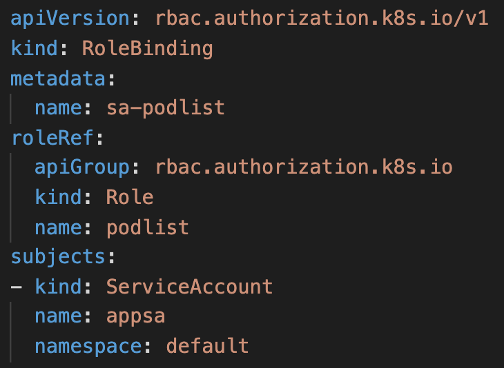

# <ins> K8s : Service Account </ins>

Have you guys ever wonder that when you access the API Server through kubectl you are authenticated through API controller but how will you acheive the same process from the pod side, so here Service Account role comes into play. As k8s definition itself says **"Processes in containers inside pods can also contact the apiserver. When they do, they are authenticated as a particular Service Account (for example, default)."**

<br>
<br>

## Things we should know about SA
- Created in a namespace
- Used to allow a process in a pod access to the API Server.
- Default service account = default (no access to the api server)
- Create your own service account.
    - Use it in a RoleBinding or ClusterRoleBinding
    - Use the service account secret to obtain the authentication token & CA certificate.

<br>
<br>

## What we will be covering today
- Creating a pod (automatically get created in default SA)
- Will create a SA 
- Creating a deployment which will be using appsa Service Account.
- RBAC

<br>


<br>

## **STEP1**
Creating a pod with a default service account, as we are not mentioning any SA(Service Account) here.

```
kubectl run -it --rm alpine --image=alpine -- sh
```

So, whenever we create with a SA(Service Account) then its certs & token automatically gets mounted on the pod as well, the location of those credentials are,

```
# cd /var/run/secrets/kubernetes.io/serviceaccount
# ls
# ca.crt     namespace  token
```

Here, we will be using ca.crt & token.

ca.crt - used to make the tls connection with API Server through curl.

token - jwt token, used to authenticate to the cluster.

Through jwt utility you can see the contents of the token,

```
jwt <token>
```


<br>
<br>

## **STEP2**

Creating the SA but before that you can check the manifest from the below command.
```
kubectl create serviceaccount appsa --dry-run=client -o yaml

OUTPUT:

apiVersion: v1
kind: ServiceAccount
metadata:
  creationTimestamp: null
  name: appsa
```

Finally, create the SA

```
kubectl create serviceaccount appsa
```
Checking SA,
```
kubectl get sa

OUTPUT:

NAME      SECRETS   AGE
appsa     1         2s
default   1         18d
```

So whenever we create SA, we are also provided with a secret attached to it, to get that

```
kubectl get secret

OUTPUT:

NAME                  TYPE                                  DATA   AGE
appsa-token-fzmbd     kubernetes.io/service-account-token   3      105s
default-token-st8t8   kubernetes.io/service-account-token   3      18d
```

To get the token, you can use the below command.
```
kubectl get secret appsa-token-fzmbd -o yaml
```
OUTPUT:


### **NOTE:** Above image has very critical information so kindly do not share it with anyone else.

<br>

Also you can see that we got the ca.crt, namespace & token. As we all know that in k8s tokens are base64 encoded, so to decode that we will be using below command,

```
echo <token> | base64 -d

# -d = decode
```
Now you can use the decoded token to get the information by using jwt, as we did earlier also.

```
jwt <decoded token>
```
<br>
<br>

## **STEP3**

Here, we will be creating a deployment.yaml


applying it,
```
kubectl apply -f deployment.yaml
```

Checking,
```
kubectl get deploy

OUTPUT:

NAME            READY   UP-TO-DATE   AVAILABLE   AGE
sa-deployment   1/1     1            1           15s
```

Now describe the pod which is created from this deployment.
```
kubectl describe pod <pod name>

OUTPUT:

Mounts:
      /var/run/secrets/kubernetes.io/serviceaccount from appsa-token-fzmbd (ro)
```

As you can see that, this pod is automatically mounted with the token of SA appsa.

Now, move into the deployment pod through,
```
kubectl exec -it <pod name> sh
```

Create a variable for certificate & Token
```
CA=/run/secrets/kubernetes.io/serviceaccount/ca.crt

TOKEN=$(cat /run/secrets/kubernetes.io/serviceaccount/token)
```

Now we will hit the k8s api server with the below GET request,
```
curl --cacert $CA -X GET https://kubernetes/api --header "Authorization: Bearer $TOKEN"

OUTPUT:

{
  "kind": "APIVersions",
  "versions": [
    "v1"
  ],
  "serverAddressByClientCIDRs": [
    {
      "clientCIDR": "0.0.0.0/0",
      "serverAddress": "ip-10-0-48-60.us-east-2.compute.internal:443"
    }
  ]
}
```

***NOTE:*** As it is recommended to use both CA & Token but if you don't want to use ca.crt then you can use the option **--insecure** in the curl command.

Although, we can successfully authenticate to the api server but still we don't have any kind of access over the cluster & as we all are familiar in k8s that how we provide access of k8 resources.

<br>
<br>

## **STEP4**
We will be creating a role.yaml for the service account. Access is granted only to list out the pods.


Apply,
```
kubectl apply -f role.yaml
```


<br>
<br>

Now we will create a rolebinding.yaml



<br>

Apply,
```
kubectl apply -f rolebinding.yaml
```

<br>

Now move into the deployment pod & hit the below curl,

```
curl --cacert $CA -X GET https://kubernetes/api/v1/namespaces/default/pods --header "Authorization: Bearer $TOKEN" | head -n 10
```

OUTPUT:
```
  % Total    % Received % Xferd  Average Speed   Time    Time     Time  Current
                                 Dload  Upload   Total   Spent    Left  Speed
  0     0    0     0    0     0      0      0 --:--:-- --:--:-- --:--:--     0{
  "kind": "PodList",
  "apiVersion": "v1",
  "metadata": {
    "resourceVersion": "3561361"
  },
  "items": [
    {
      "metadata": {
        "name": "sa-deployment-569fd7c496-vh7h2",
        "generateName": "sa-deployment-569fd7c496-",
        "namespace": "default",
        "uid": "94cf84e3-02f8-4191-87a5-48fe93404560",
        "resourceVersion": "3539771",
        "creationTimestamp": "2022-02-01T09:11:21Z",
        "labels": {
          "app": "sa",
          "pod-template-hash": "569fd7c496"
        },
        "annotations": {
100  7057    0  7057    0     0   287k      0 --:--:-- --:--:-- --:--:--  287k
```

### Voila! 
